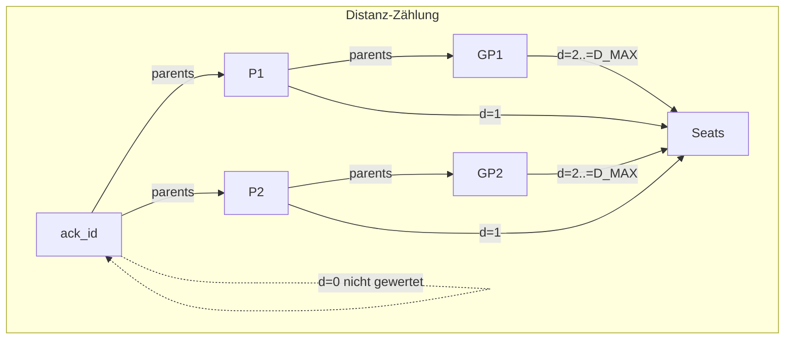

# Phantom-Coin: Fees & Payout Spec (v0)

Ziel: Deterministische Gebührenaufteilung ohne Unix-Zeit im Konsenspfad. Verteilung erfolgt via Merkle-Payout-Root und ist vollständig aus den Inputs (Fees, Empfänger-IDs, Ack-Distanzen, Parameter) deterministisch.

## Parameter (Basispunkte, Gewichte)
- Basispunkte (Summe = 10_000):
  - `P_BASE_BP` (Basis-Floor), `P_PROP_BP` (Proposer-Anteil), `P_PERF_BP` (Performance-Topf), `P_ATT_BP` (Attestor-Topf)
- Ack-Distanz-Cap/Abklingung:
  - `D_MAX` (maximale gewertete Distanz)
  - α in ganzzahliger Form: `PERF_ALPHA_NUM` / `PERF_ALPHA_DEN`
  - Empfohlene Gewichtsliste `perf_weights_recommended()` erzeugt eine streng fallende Folge `w[0..D_MAX-1]` mit Startwert 10_000 und Abklingung α je Schritt (nicht nullend; min 1).

Siehe `pc-consensus/src/consts.rs` für die v0-Startwerte:
- `P_BASE_BP=6500`, `P_PROP_BP=1000`, `P_PERF_BP=1500`, `P_ATT_BP=1000`
- `D_MAX=8`, `α=0.6` (als `PERF_ALPHA_NUM=6`, `PERF_ALPHA_DEN=10`)

## Aufteilung der Gebühren
Gegeben `fees_total` und Committee (Seats) mit Empfänger-IDs `recipients: [[u8;32]; k]`, Proposer-Index `proposer_index`, sowie Ack-Distanzen `ack_distances: [Option<u8>; k]`:

1) Pots (Topfgrößen) in Basispunkten:
```
base_pot = floor(fees_total * P_BASE_BP / 10000)
prop_pot = floor(fees_total * P_PROP_BP / 10000)
perf_pot = floor(fees_total * P_PERF_BP / 10000)
att_pot  = floor(fees_total * P_ATT_BP / 10000)
```
Summe der Pots ≤ `fees_total` (Rundung nach unten). Remainder < 4 und wird nicht weiter verteilt (deterministisch, keine Drift).

2) Verteilung
- Basis-Floor (`base_pot`): gleichmäßig auf alle `k` Seats (`distribute_equal()`), remainder deterministisch nach `recipient_id` (aufsteigend) verteilt.
- Proposer (`prop_pot`): vollständig an `recipients[proposer_index]`.
- Performance (`perf_pot`): proportional nach `ack_distances`:
  - Für Seat i: `d = ack_distances[i]` → Gewicht `w_i = w[d-1]`, wenn 1 ≤ d ≤ `D_MAX`; sonst `w_i = 0`.
  - Verteilung per `distribute_by_weights(perf_pot, recipients, w_i)`, remainder deterministisch nach `recipient_id`.
- Attestor-Topf (`att_pot`): gleichmäßig auf die Attestor-Stichprobe `attestors: [[u8;32]]` verteilt (`distribute_equal()`), remainder deterministisch nach `recipient_id`.

3) Merkle-Payout
- Alle (Committee- und Attestor-)Payouts werden als `PayoutSet` zusammengeführt.
- Merkle-Root wird deterministisch über `pc_types::payout_leaf_hash`/`merkle_root_hashes` gebildet (einheitliche Sortierung; Duplikate pro Empfänger werden beim Root-Build konsolidiert).

## Implementierung
- `pc-consensus/src/lib.rs`:
  - `FeeSplitParams { p_base_bp, p_prop_bp, p_perf_bp, p_att_bp, d_max, perf_weights }`
    - `validate()`: prüft Summe=10_000, `perf_weights.len() == d_max`, monotone Abnahme.
    - `recommended()`: zieht Default-Werte aus `consts.rs` und generiert `perf_weights` aus α, `D_MAX`.
  - `compute_committee_payout()` verteilt Basis/Proposer/Performance.
  - `compute_attestor_payout()` verteilt den Attestor-Topf.
  - `compute_total_payout_root()` vereinigt Committee + Attestor und liefert die Merkle-Root.
  - Hilfen: `split_bp`, `distribute_equal`, `distribute_by_weights` (deterministische Remainder-Verteilung nach `recipient_id`).

## Tests & Invarianten
- `recommended_params_invariants`: Summe=10_000, `len(weights)==D_MAX`, Gewichte monoton fallend.
- `fee_split_committee`: Summe der ausgezahlten Beträge == Summe (Basis+Proposer+Performance).
- `fee_split_attestors`: Summe == `att_pot`.
- `split_sums_match_total`: Summe (Committee + Attestor) == Summe aller Pots; Remainder < 4.
- Ack-Distanz-Berechnung konsistent über `AnchorGraphCache` vs. direkte Slice-Funktion.

## Beispiel (Golden)

Eingaben:
- recipients = `[blake3_32("a"), blake3_32("b"), blake3_32("c")]`
- attestors  = `[blake3_32("x"), blake3_32("y")]`
- fees_total = `42_000`
- params = `FeeSplitParams::recommended()` (siehe `consts.rs`)
- ack_distances = `[Some(1), Some(2), None]`, proposer_index = `1`

Ergebnis (Golden Merkle-Root):

```
TOTAL_PAYOUT_ROOT_SPEC=668f75fc7225e3270bc17cdf864e11c4448a2066142621f926a3903cae7deb14
```

Quelle: Test `total_payout_root_golden` in `crates/pc-consensus/src/lib.rs`.

### Diagramm: Fee-Split Datenfluss

```mermaid
flowchart LR
    F[fees_total] --> P1[p_base_bp] --> B[base_pot]
    F --> P2[p_prop_bp] --> PR[prop_pot]
    F --> P3[p_perf_bp] --> PE[perf_pot]
    F --> P4[p_att_bp] --> AT[att_pot]

    B -->|distribute_equal| C1[committee_base_entries]
    PR -->|full to proposer| C2[committee_prop_entry]
    PE -->|weights(ack_distances)| C3[committee_perf_entries]
    AT -->|distribute_equal| A1[attestor_entries]

    C1 --> M[merge]
    C2 --> M
    C3 --> M
    A1 --> M
    M --> R[payout_root]
```

### Diagramm: Ack-Distanzen (vereinfacht)



## Konfiguration / Genesis
- Netzbetreiber können `FeeSplitParams` über Genesis/Config vorgeben.
- Änderungen an α/`D_MAX`/Basispunkten sind Konsens‑relevant (Hardfork‑Thema) und müssen versioniert kommuniziert werden.

## Sicherheit / Determinismus
- Keine Unix‑Zeit im Pfad; alles deterministisch.
- Remainder-Handhabung ist deterministisch fixiert, kein nondeterministisches Tie‑Breaking.
- `k ≤ 64` (vote_mask in `u64`), Parents `P ≤ 4` (vgl. `pc-types`).
